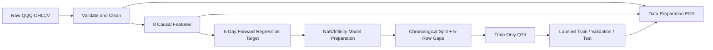

# QQQ Volatility Forecasting — Project Status

> ตรวจสอบล่าสุด: 2026-09-20
>
> ขอบเขตการตรวจ: source code, tests, notebooks และ saved outputs ใน working directory ปัจจุบัน โดยไม่แก้ไขหรือรัน pipeline ที่เขียนทับ artifacts
>
> Git ณ เวลาตรวจ: branch `main`, commit `e69e588` (`docs: add data preparation and insights notebooks`), working tree สะอาดก่อนสร้างรายงานนี้

## 1. ภาพรวมโปรเจกต์

โปรเจกต์นี้เตรียมข้อมูลรายวันของ QQQ เพื่อพยากรณ์ realized volatility ล่วงหน้า 5 trading days โดยใช้ `Close` เป็นราคาหลักและไม่ใช้ `Adj Close`

- ข้อมูลต้นทางคือ daily OHLCV: `Date`, `Open`, `High`, `Low`, `Close`, `Volume` จาก `data/raw/qqq_daily.csv`
- งาน Regression ต้องการทำนายค่าต่อเนื่อง `target_volatility_5d` ซึ่งเป็น annualized sample standard deviation ของ 5 future daily returns
- งาน Classification ต้องการทำนาย `target_high_volatility` ว่า future volatility สูงกว่า Q75 ที่คำนวณจาก Train หรือไม่
- Use case ที่ระบุได้จาก Notebook คือช่วยประเมินความผันผวนระยะสั้นและแยกช่วง Normal/High Volatility; ยังไม่มีหลักฐานว่าเป็นระบบซื้อขายหรือรับประกันผลตอบแทน

ไม่พบเอกสาร Project Description หรือ Project List แยกต่างหาก และ `README.md` ยังว่าง จึงยังยืนยันรายการ model algorithms, metrics และรูปแบบไฟล์ส่งงานที่โจทย์ภายนอกต้องการไม่ได้

## 2. Requirement จากโจทย์

| Requirement | สถานะ | หลักฐาน | หมายเหตุ |
| ----------- | ----- | ------- | -------- |
| โหลด daily QQQ OHLCV และตรวจ required columns | ✅ เสร็จแล้ว | `src/load_data.py`, `tests/test_load_data.py` | ไม่แปลงหรือเดาชื่อ column |
| ทำความสะอาดและบันทึก clean artifact | ✅ เสร็จแล้ว | `src/clean_data.py`, `data/interim/qqq_clean.csv`, `outputs/reports/cleaning_report.json` | ข้อมูลจริงไม่ถูกลบ: 2,512 → 2,512 แถว |
| สร้าง causal features จากข้อมูลปัจจุบัน/อดีต | ✅ เสร็จแล้ว | `src/build_features.py`, `data/interim/qqq_features.csv`, `tests/test_features.py`, `tests/test_leakage.py` | มี 8 features; tests ตรวจว่า future values ไม่เปลี่ยนอดีต |
| สร้าง Regression target ล่วงหน้า 5 วัน | ✅ เสร็จแล้ว | `src/build_targets.py`, `data/interim/qqq_regression_target.csv`, `tests/test_targets.py` | ใช้ returns ที่ `t+1` ถึง `t+5`, `ddof=1`, `sqrt(252)` |
| เตรียม modeling rows และจัดการ NaN/Infinity | ✅ เสร็จแล้ว | `src/split_data.py`, `outputs/reports/data_split_report.json` | ลบ 25 แถวที่มีค่า model ไม่พร้อม; Infinity ใน artifact จริง = 0 |
| แบ่ง Train/Validation/Test ตามเวลาและมี purging gap | ✅ เสร็จแล้ว | `src/split_data.py`, `data/processed/{train,validation,test}.csv`, `tests/test_split_data.py` | 70/15/15 หลังกัน gap 5 แถวสองช่วง |
| สร้าง Classification target จาก Train-only Q75 | ✅ เสร็จแล้ว | `src/build_targets.py`, `data/processed/*_labeled.csv`, `outputs/reports/classification_threshold.json` | ใช้ `>`; ค่าเท่ากับ threshold เป็น class 0 |
| EDA และ Data Preparation notebooks พร้อม saved outputs | ✅ เสร็จแล้ว | `notebooks/01_data_cleaning.ipynb`, `notebooks/02_eda_and_features.ipynb`, `outputs/figures/data_preparation/` | ทุก code cell มี execution count/output และไม่พบ saved error |
| Regression model training | ⬜ ยังไม่พบว่าดำเนินการ | `src/models/regression.py`, `notebooks/03_regression.ipynb` | ไฟล์ Python มีเพียง module docstring; Notebook มี 0 cells |
| Classification model training | ⬜ ยังไม่พบว่าดำเนินการ | `src/models/classification.py`, `notebooks/04_classification.ipynb` | ไฟล์ Python มีเพียง module docstring; Notebook มี 0 cells |
| Model evaluation และ comparison | ⬜ ยังไม่พบว่าดำเนินการ | `outputs/metrics/.gitkeep`, `outputs/models/.gitkeep` | ไม่มี metrics, fitted model หรือ model-comparison report |
| Project documentation และ reproducible run instructions | 🟡 ทำบางส่วน | Notebooks, `requirements.txt`, `config.py`; `README.md` ว่าง | ยังไม่มีคำสั่งรัน pipeline ตั้งแต่ต้นจนจบหรือ data provenance |
| Automated tests | ✅ เสร็จแล้ว | `tests/`, `pytest.ini` | ตรวจรอบนี้ด้วย `python -m pytest -q -p no:cacheprovider`: 143 passed |
| Project Description / Project List | ⚠️ ต้องตรวจสอบ/แก้ไข | ไม่พบไฟล์ดังกล่าวใน repository | ต้องนำ requirement ต้นฉบับมาเพิ่มก่อนเลือก models/metrics ขั้นสุดท้าย |

## 3. โครงสร้างและ Data Pipeline ปัจจุบัน

ลำดับที่ยืนยันได้จาก implementation และ artifacts คือ:

1. `data/raw/qqq_daily.csv` → validate schema ด้วย `src/load_data.py`
2. `src/clean_data.py` → `data/interim/qqq_clean.csv` และ `cleaning_report.json`
3. `src/build_features.py` → `data/interim/qqq_features.csv` และ `feature_report.json`
4. `src/build_targets.py` → `data/interim/qqq_regression_target.csv`
5. `src/split_data.py` → replace Infinity เป็น NaN เฉพาะ modeling copy, drop invalid model rows, chronological split พร้อม gap → `train.csv`, `validation.csv`, `test.csv` และ `data_split_report.json`
6. `src/build_targets.py::run_classification_target_pipeline()` → คำนวณ Q75 จาก Train และสร้าง `*_labeled.csv` พร้อม `classification_threshold.json`
7. `01_data_cleaning.ipynb` และ `02_eda_and_features.ipynb` อ่าน artifacts เพื่อทำ validation/EDA และสร้างกราฟ 12 ไฟล์

ยังไม่พบ Model preprocessing/scaling, Regression training, Classification training, model evaluation หรือ persisted model artifacts และไม่มี orchestration script ที่เรียกทุกขั้นด้วยคำสั่งเดียว

## 4. สิ่งที่ทำเสร็จแล้ว

### 4.1 Data Cleaning

- `src/load_data.py` ตรวจ file existence, empty CSV และ required columns โดยไม่แก้ข้อมูลดิบ
- `src/clean_data.py` parse/sort `Date`, แปลง numeric, จัดการ missing, duplicates, invalid OHLC/price/volume และป้องกัน overwrite raw data
- Artifact และ report มีอยู่จริง; `cleaning_report.json` ระบุ 2,512 แถวทั้งก่อนและหลัง, ไม่มี missing/duplicate/invalid rows ในชุดปัจจุบัน
- ข้อจำกัด: cleaning ไม่มี explicit Infinity rule; artifact ปัจจุบันไม่มี Infinity และ explicit handling อยู่ใน Modeling Data Preparation

### 4.2 Exploratory Data Analysis

- `notebooks/01_data_cleaning.ipynb` มี 21 cells (9 code cells รันแล้ว) พร้อม validation, before/after summary และ checksum audit
- `notebooks/02_eda_and_features.ipynb` มี 32 cells (15 code cells รันแล้ว) ครอบคลุม price/return/volatility, train-only distributions/correlation, targets, splits และ class distribution
- Saved notebooks ไม่มี error output และท้าย Notebook ยืนยัน input checksums ไม่เปลี่ยน
- กราฟ full-period ถูกกำกับเป็น descriptive analysis; การวิเคราะห์ที่มีผลต่อ modeling ใช้ Train

### 4.3 Feature Engineering

- `src/build_features.py` สร้าง 8 features ตามตารางในหัวข้อ 5 และแทน feature Infinity ด้วย NaN หลังนับเพื่อทำ report
- `feature_report.json` บันทึก NaN ตาม warm-up windows, first valid date, min/max และ Infinity count
- ตรวจซ้ำแบบ read-only แล้วค่าที่คำนวณใหม่จาก `qqq_clean.csv` ตรงกับ `qqq_features.csv` ภายใน tolerance

### 4.4 Target Construction

- Regression target ใช้ 5 future returns ไม่รวม return ณ `t`; 5 แถวท้ายเป็น NaN
- Classification target ใช้ threshold เดียวกันทุก split โดยคำนวณ Q75 จาก Train เท่านั้น
- ตรวจซ้ำแล้ว regression target, threshold และ labels ตรงกับ saved artifacts
- ข้อจำกัด: ยังไม่มี `regression_target_report.json`; มีเพียง target CSV, tests และ summary ที่ `main()` สามารถพิมพ์ได้

### 4.5 Data Splitting

- กรองเฉพาะ NaN/Infinity ใน 8 features และ Regression target แล้ว split แบบ chronological โดยไม่ shuffle
- กัน 5 rows ระหว่าง Train–Validation และ Validation–Test เพื่อไม่ให้ forward target horizon ข้ามเข้า split ถัดไป
- Saved splits ตรงกับผลคำนวณจาก pure functions และ source checksum ก่อน/หลังตรงกัน

### 4.6 Regression

- 🟡 ทำเฉพาะ target และ modeling dataset พร้อมใช้งาน
- ยังไม่มี model class, baseline, training, hyperparameter selection, validation metrics หรือ test metrics

### 4.7 Classification

- 🟡 ทำ target labeling เสร็จ รวมทั้ง threshold report และ class distribution
- ยังไม่มี classifier, class-imbalance strategy, probability calibration, threshold สำหรับ prediction หรือ evaluation

### 4.8 Evaluation และ Outputs

- Data-quality และ leakage-related validation มี automated tests 143 tests ซึ่งผ่านทั้งหมดในการตรวจรอบนี้
- มี reports 4 ไฟล์และ figures 12 ไฟล์สำหรับ data preparation
- ยังไม่มี model metrics, predictions, fitted models หรือ model-comparison outputs

### 4.9 Presentation หรือ Documentation

- Data Preparation notebooks มี narrative, formulas, saved outputs และรูปภาพพร้อมใช้อธิบายขั้นตอนข้อมูล
- `requirements.txt`, `config.py` และ module docstrings มีอยู่
- `README.md` ว่าง; ไม่พบ slide deck, Project Description, Project List หรือ final presentation

## 5. Feature และ Target ที่พบ

### Features

| Feature | ความหมาย | วิธีคำนวณโดยสรุป | Notebook/ไฟล์ | สถานะ |
| ------- | -------- | ---------------- | ------------- | ----- |
| `return_1d` | ผลตอบแทน 1 วัน | `Close.pct_change(1)` | `src/build_features.py`, Notebook 02 | ✅ เสร็จแล้ว |
| `return_5d` | ผลตอบแทนย้อนหลัง 5 วัน | `Close.pct_change(5)` | `src/build_features.py`, Notebook 02 | ✅ เสร็จแล้ว |
| `historical_volatility_5d` | realized volatility ย้อนหลังระยะสั้น | trailing 5-day std ของ `return_1d`, `ddof=1`, คูณ `sqrt(252)` | `src/build_features.py`, Notebook 02 | ✅ เสร็จแล้ว |
| `historical_volatility_20d` | realized volatility ย้อนหลังระยะกลาง | trailing 20-day std ของ `return_1d`, `ddof=1`, คูณ `sqrt(252)` | `src/build_features.py`, Notebook 02 | ✅ เสร็จแล้ว |
| `intraday_range` | ช่วงราคาในวันเทียบกับ Close | `(High - Low) / Close` | `src/build_features.py`, Notebook 02 | ✅ เสร็จแล้ว |
| `sma_ratio_5_20` | momentum/trend ระยะสั้นเทียบกลาง | trailing `SMA_5 / SMA_20` | `src/build_features.py`, Notebook 02 | ✅ เสร็จแล้ว |
| `rsi_14` | Wilder RSI 14 ช่วง | seed gain/loss ด้วย simple average 14 ช่วงแรก แล้ว recursive Wilder average | `src/build_features.py`, Notebook 02 | ✅ เสร็จแล้ว |
| `volume_zscore_20` | Volume เทียบ rolling baseline | `(Volume - mean_20) / std_20`, `ddof=1`; zero std → NaN | `src/build_features.py`, Notebook 02 | ✅ เสร็จแล้ว |

ทุก rolling feature เป็น trailing window และไม่มี negative shift; `tests/test_leakage.py` ยืนยันว่าการแก้ future rows ไม่เปลี่ยน features ณ หรือก่อน cutoff

### Targets

| Target | ประเภทงาน | วิธีสร้าง | ความเสี่ยง Leakage | สถานะ |
| ------ | --------- | --------- | ------------------ | ----- |
| `target_volatility_5d` | Regression | `std(return_1d[t+1:t+5], ddof=1) * sqrt(252)`; 5 แถวท้ายเป็น NaN | Target ใช้อนาคตโดยตั้งใจ จึงต้องแยกจาก features; gap 5 rows ป้องกัน target ของ split ก่อนหน้าทับช่วง split ถัดไป | ✅ เสร็จแล้ว |
| `target_high_volatility` | Binary Classification | `1` เมื่อ `target_volatility_5d > Train Q75`, มิฉะนั้น `0` | Threshold ต้อง fit จาก Train เท่านั้น; implementation และ report ยืนยันว่า Validation/Test ไม่ร่วมคำนวณ | ✅ เสร็จแล้ว |

การสร้าง Regression target เกิดก่อน split แต่ใช้ purging gap เท่ากับ horizon 5 แถว และ Classification threshold เกิดหลัง split จาก Train เท่านั้น จึงยังไม่พบ leakage ในขั้น Data Preparation ปัจจุบัน

## 6. Dataset และ Data Split

### Dataset summary

| Dataset | ช่วงวันที่ | แถว | Missing/Infinity ที่สำคัญ |
| ------- | ---------- | ---: | ------------------------- |
| Raw `qqq_daily.csv` | 2016-08-31 ถึง 2026-08-28 | 2,512 | 0 / 0 |
| Clean `qqq_clean.csv` | 2016-08-31 ถึง 2026-08-28 | 2,512 | 0 / 0 |
| Features `qqq_features.csv` | 2016-08-31 ถึง 2026-08-28 | 2,512 | 83 NaN cells จาก warm-up windows; 0 Infinity |
| Regression target `qqq_regression_target.csv` | 2016-08-31 ถึง 2026-08-28 | 2,512 | 88 NaN cells รวม target 5 แถวท้าย; 0 Infinity |
| Modeling-ready ก่อน gap | 2016-09-29 ถึง 2026-08-21 | 2,487 | 25 rows ถูกกรอง; ไม่มี NaN/Infinity ใน model columns |

`data/processed/qqq_features_target.csv` เป็นไฟล์ขนาด 0 bytes และไม่ใช่ path ที่ `config.py` ใช้ จึงไม่ถือเป็น valid artifact

### Split summary

| Split | ช่วงวันที่ | จำนวนแถว | Normal | High | High ratio |
| ----- | ---------- | --------: | -----: | ---: | ---------: |
| Train | 2016-09-29 ถึง 2023-08-18 | 1,733 | 1,300 | 433 | 24.9856% |
| Validation | 2023-08-28 ถึง 2025-02-19 | 371 | 337 | 34 | 9.1644% |
| Test | 2025-02-27 ถึง 2026-08-21 | 373 | 300 | 73 | 19.5710% |

- Gap 1: 2023-08-21 ถึง 2023-08-25 จำนวน 5 rows
- Gap 2: 2025-02-20 ถึง 2025-02-26 จำนวน 5 rows
- Usable rows หลังหักสอง gaps: 2,477 = 1,733 + 371 + 373
- Feature columns: `return_1d`, `return_5d`, `historical_volatility_5d`, `historical_volatility_20d`, `intraday_range`, `sma_ratio_5_20`, `rsi_14`, `volume_zscore_20`
- Regression target: `target_volatility_5d`
- Classification target: `target_high_volatility`
- Classification threshold: `0.2530580184684854` หรือ `25.305801846848542%`, Q75 แบบ `linear` จาก Train เท่านั้น

สัดส่วน High แตกต่างกันระหว่าง splits ซึ่งอาจบ่งชี้ distribution shift หรือสภาวะตลาดที่แตกต่างกัน แต่หลักฐานนี้เพียงอย่างเดียวยังไม่เพียงพอสำหรับยืนยันการเปลี่ยน market regime

## 7. กราฟและผลลัพธ์ที่มีอยู่

| ไฟล์กราฟ/ผลลัพธ์ | แสดงอะไร | ใช้พิจารณาอะไร | สถานะ |
| ---------------- | -------- | -------------- | ----- |
| `01_missing_values_before_after.png` | Missing values ของ Raw/Clean | Data quality ก่อน–หลัง cleaning | ✅ มีไฟล์และตรงกับ count = 0 |
| `02_close_price_over_time.png` | Close history ทั้งช่วง | Descriptive price history | ✅ มีไฟล์; descriptive only |
| `03_daily_return_over_time.png` | Daily return ตามเวลา | เหตุการณ์ return ผันผวน | ✅ มีไฟล์; descriptive only |
| `04_daily_return_distribution.png` | Distribution ของ daily returns | รูปร่าง distribution/outliers | ✅ มีไฟล์; descriptive only |
| `05_historical_volatility.png` | 5-day/20-day historical volatility | เปรียบเทียบความไวของ windows | ✅ มีไฟล์; descriptive only |
| `06_feature_distributions.png` | Distribution ของ 8 features | Train-only modeling diagnostics | ✅ มีไฟล์และ label ครบ |
| `07_train_feature_correlation.png` | Correlation ของ features กับ Regression target | Train-only multicollinearity/association | ✅ มีไฟล์และค่าอ่านได้ |
| `08_train_regression_target_distribution.png` | Distribution ของ `target_volatility_5d` | Train-only target shape | ✅ มีไฟล์ |
| `09_train_target_with_q75.png` | Regression target พร้อม Q75 = 25.31% | ตรวจ classification cutoff | ✅ มีไฟล์และตรงกับ report |
| `10_time_series_split.png` | Train/Gap/Validation/Gap/Test timeline | ตรวจลำดับตามเวลา | 🟡 ถูกต้อง แต่ gap 5 แถวมองเห็นยากเมื่อ plot ทั้ง 10 ปี |
| `11_class_distribution_by_split.png` | Normal/High counts แต่ละ split | Class imbalance/distribution shift | ✅ มีไฟล์และ counts ตรงกับ report |
| `12_modeling_data_quality.png` | NaN/Infinity ของ model splits | ความพร้อมก่อน modeling | ✅ มีไฟล์และ count = 0 |
| `cleaning_report.json` | Cleaning counts และ date bounds | Audit data cleaning | ✅ มีไฟล์ |
| `feature_report.json` | Feature NaN/Infinity/min/max | Audit feature construction | ✅ มีไฟล์ |
| `data_split_report.json` | Filtering, splits, gaps และ checksum | Audit modeling preparation | ✅ มีไฟล์ |
| `classification_threshold.json` | Q75, labels distribution และ source checksums | Audit classification labeling | ✅ มีไฟล์ |
| Regression target report | Target rows/date/NaN/formula metadata | Audit target artifact โดยไม่อ่าน CSV ใหม่ | ⬜ ยังไม่พบว่าดำเนินการ |
| Model metrics / fitted models | ผลประเมินและ deployable artifacts | Model comparison/deployment | ⬜ ยังไม่พบว่าดำเนินการ |

ตรวจเปิดไฟล์ PNG ทั้ง 12 ไฟล์แล้ว ทุกไฟล์เป็นภาพที่อ่านได้และสอดคล้องกับ code cells ที่บันทึกภาพใน Notebook 01/02

## 8. ปัญหา ความเสี่ยง และสิ่งที่ต้องตรวจสอบ

### Critical

- **ยังไม่พบ Critical leakage/correctness issue ใน Data Preparation ปัจจุบัน** — หลักฐาน: causal feature tests, forward-target tests, 5-row purging gaps, train-only threshold tests และการตรวจ artifact alignment รอบนี้ทั้งหมดผ่าน อย่างไรก็ตามยังประเมิน leakage ของ model preprocessing/hyperparameter tuning ไม่ได้เพราะยังไม่มี implementation

### Important

1. **ยังไม่มี Regression/Classification models และ evaluation**
   - หลักฐาน: `src/models/*.py` มีเพียง docstring, Notebook 03/04 มี 0 cells, `outputs/models` และ `outputs/metrics` ไม่มี artifacts
   - ผลกระทบ: โปรเจกต์ยังไม่ตอบโจทย์การ forecast หรือเปรียบเทียบ model
   - แนะนำ: ยืนยัน model/metric requirements แล้วสร้าง baseline, candidates, validation workflow และ final test evaluation

2. **ไม่พบ Project Description, Project List และ README ใช้งานไม่ได้เพราะว่าง**
   - หลักฐาน: พบ Markdown เฉพาะ `README.md` ขนาด 0 bytes ก่อนสร้างรายงานนี้
   - ผลกระทบ: ยืนยัน algorithms, acceptance criteria และ deliverables ภายนอกไม่ได้
   - แนะนำ: เพิ่ม requirement ต้นฉบับและ runbook ก่อนตัดสินใจเรื่อง models

3. **Fresh clone ยังสร้าง artifacts ซ้ำไม่ได้โดยตัวมันเอง**
   - หลักฐาน: `.gitignore` ไม่ track `data/**` และ generated `outputs/**`; `git ls-files` มีเพียง `.gitkeep`; ไม่มี data acquisition script หรือ orchestrator
   - ผลกระทบ: ผู้รับงานต่อไม่มี raw data/artifacts จาก Git และไม่ทราบแหล่งข้อมูล/checksum
   - แนะนำ: จัดทำ data provenance และวิธีวาง raw file อย่างถูกกฎหมาย พร้อม script/command orchestration และ checksum/schema validation

4. **มี stale empty artifact ที่ชื่อชวนสับสน**
   - หลักฐาน: `data/processed/qqq_features_target.csv` ขนาด 0 bytes ขณะที่ path จริงคือ `data/interim/qqq_regression_target.csv`
   - ผลกระทบ: ผู้ใช้หรือ Notebook ใหม่อาจอ่านไฟล์ผิด
   - แนะนำ: ยืนยันว่าไม่ใช่ deliverable แล้วลบหรือแทนด้วย artifact ที่มี contract ชัดเจน

5. **ไม่มี Regression target report**
   - หลักฐาน: `run_regression_target_pipeline()` บันทึก CSV และ verify แต่ไม่บันทึก JSON report
   - ผลกระทบ: audit target ต้องอ่าน CSV/โค้ดและไม่มี metadata/checksum แบบ pipeline ขั้นอื่น
   - แนะนำ: เพิ่ม strict JSON report พร้อม formula metadata, counts, date bounds และ source checksum

6. **ยังไม่มี end-to-end integration test/runner**
   - หลักฐาน: tests แยกตาม module; ไม่มี script ที่รัน Clean → Features → Target → Split → Labels ใน temporary paths
   - ผลกระทบ: contract ระหว่างขั้นอาจ drift ในอนาคตแม้ unit tests ผ่าน
   - แนะนำ: เพิ่ม integration test ที่ใช้ fixture data และ runner ที่ fail fast โดยไม่ overwrite raw

### Minor

1. `requirements.txt` ไม่ pin versions ทำให้ reproducibility ข้าม environment ไม่แน่นอน; ควรเพิ่ม lock/constraints หลังเลือก modeling libraries
2. `tests/test_cleaning.py` มีเพียง docstring และซ้ำเชิงชื่อกับ `tests/test_clean_data.py`; ควรลบหรือรวมเมื่อได้รับอนุญาต
3. Reports บางไฟล์บันทึก absolute Windows paths; ควรใช้ project-relative paths เพื่อย้ายเครื่องได้ง่าย
4. `10_time_series_split.png` แสดง gaps ถูกต้องแต่แถบแคบมาก; ควรมี inset หรือ boundary annotations ใน presentation
5. `src/build_targets.py::main()` รันเฉพาะ Regression target; Classification pipeline ต้องเรียกผ่าน import จึงควรมี CLI/runner ที่ชัดเจน

## 9. งานที่ต้องทำต่อ

### Phase 1 — ตรวจสอบและเตรียมข้อมูล

- [ ] **ยืนยัน requirement ต้นฉบับและ data provenance** — สร้าง/แก้ `README.md` และเอกสาร requirement; ระบุ source, license, retrieval date, schema, algorithms/metrics ที่ต้องส่ง; DoD: ผู้รับงานใหม่ตอบได้ว่าข้อมูลมาจากไหนและต้องส่งอะไร; dependency: ไม่มี
- [ ] **จัดการ stale artifact และเพิ่ม Regression target report** — แก้ `config.py`, `src/build_targets.py`, tests และพิจารณา `data/processed/qqq_features_target.csv`; คาดหวัง JSON report/checksum และไม่มีไฟล์กำกวม; DoD: test ครอบคลุมและ report strict JSON ตรงกับ CSV; dependency: requirement review
- [ ] **สร้าง end-to-end data runner** — สร้างเช่น `src/run_data_pipeline.py`; รัน Load → Clean → Features → Regression Target → Split → Classification Labels แบบ fail fast; DoD: รันจาก project root ได้และ outputs ตรงกับ module contracts; dependency: path/report contract ข้างต้น
- [ ] **เพิ่ม integration test** — สร้าง `tests/test_data_pipeline.py` ด้วย `tmp_path`; คาดหวังตรวจ schema, chronology, checksums และ no-overwrite; DoD: test ผ่านโดยไม่แตะข้อมูลจริง; dependency: runner

### Phase 2 — Regression Models

- [ ] **กำหนด Regression baseline และ metrics** — แก้ `README.md`/config และสร้าง tests; อย่างน้อยกำหนด naive/mean baseline กับ MAE, RMSE และ R² ตาม requirement ที่ยืนยัน; DoD: metric contracts และ baseline behavior มี tests; dependency: requirement ต้นฉบับ
- [ ] **Implement training pipeline** — แก้ `src/models/regression.py`; fit preprocessing เฉพาะ Train, เลือก hyperparameters ด้วย Validation เท่านั้น; DoD: deterministic seed/config, ไม่มี Test leakage และคืน predictions/metrics; dependency: baseline/metrics
- [ ] **สร้าง Regression Notebook** — เติม `notebooks/03_regression.ipynb`; แสดง baseline, candidates, validation selection และ final Test evaluation; DoD: run top-to-bottom และบันทึก outputs/figures; dependency: training pipeline

### Phase 3 — Classification Models

- [ ] **กำหนด Classification baseline และ metrics** — ระบุ majority baseline, Precision/Recall/F1, ROC-AUC, PR-AUC และ confusion matrix ตาม requirement; DoD: ระบุ positive class และ policy เรื่อง imbalance ชัดเจน; dependency: requirement ต้นฉบับ
- [ ] **Implement classification training** — แก้ `src/models/classification.py`; ใช้ labeled Train/Validation, fit preprocessing เฉพาะ Train และห้ามปรับ Q75 ด้วย Validation/Test; DoD: tests ยืนยัน threshold/data boundaries และ reproducible predictions; dependency: metrics contract
- [ ] **สร้าง Classification Notebook** — เติม `notebooks/04_classification.ipynb`; เปรียบเทียบ baseline/candidates และประเมิน Test ครั้งสุดท้าย; DoD: run top-to-bottom พร้อม saved outputs; dependency: classifier pipeline

### Phase 4 — Evaluation และ Model Comparison

- [ ] **บันทึก metrics, predictions และ models** — ใช้ `outputs/metrics/`, `outputs/models/`, `outputs/reports/`; เก็บ model version, feature order, parameters, seed และ data checksum; DoD: artifact โหลดซ้ำแล้วให้ผลเดิม; dependency: Regression/Classification pipelines
- [ ] **สร้าง comparison report และ diagnostic figures** — เปรียบเทียบกับ baseline, residual/error-by-time, confusion matrix, ROC/PR และ calibration ตามความเหมาะสม; DoD: ทุกกราฟอ้างอิง split/metric ถูกต้องและเลือก model จาก Validation ไม่ใช่ Test; dependency: saved predictions

### Phase 5 — Documentation และ Presentation

- [ ] **เขียน README/runbook** — อธิบาย setup, data placement, commands, artifact map, limitations และ leakage controls; DoD: ผู้ใช้ใหม่ทำตามจาก clean environment ได้; dependency: pipeline/CLI เสถียร
- [ ] **จัดทำ final presentation** — สรุป problem, data, methods, baseline comparison, results, limitations และ next steps; DoD: ตัวเลขทั้งหมด trace กลับไปยัง reports/metrics ได้; dependency: final evaluation

## 10. ลำดับงานแนะนำสำหรับรอบถัดไป

1. ขอและบันทึก Project Description/Project List หรือ requirement ต้นฉบับให้ครบ
2. ระบุ data provenance และวิธีเตรียม `qqq_daily.csv` สำหรับ fresh clone
3. แก้ความกำกวมของ `qqq_features_target.csv` และเพิ่ม Regression target report
4. สร้าง end-to-end data pipeline runner
5. เพิ่ม integration test ที่รัน pipeline ใน `tmp_path`
6. กำหนด Regression baseline, candidate models และ metrics
7. Implement/test `src/models/regression.py`
8. เติมและ execute `notebooks/03_regression.ipynb`
9. กำหนด Classification baseline/metrics แล้ว Implement/test `src/models/classification.py`
10. เติม `notebooks/04_classification.ipynb` และสร้าง model-comparison outputs

## 11. Definition of Done ของทั้งโปรเจกต์

- [ ] Data pipeline รันได้ตั้งแต่ raw input จนถึง labeled splits ด้วย documented command ใน clean environment
- [ ] ยืนยันไม่มี data leakage ครอบคลุม feature/target/split รวมทั้ง scaling, tuning และ model selection
- [ ] Regression models ครบตาม requirement และมี baseline
- [ ] Classification models ครบตาม requirement และมี baseline
- [ ] มี model comparison โดยเลือก model จาก Validation และใช้ Test สำหรับ final evaluation
- [ ] ใช้ Regression/Classification metrics ที่เหมาะสมและระบุ positive class/units ชัดเจน
- [ ] มีกราฟผลลัพธ์ระดับ model นอกเหนือจาก data-preparation figures
- [ ] บันทึก models, metrics, predictions, configuration, seed และ data checksums ที่จำเป็น
- [ ] Notebook 01–04 สามารถรันซ้ำจากต้นจนจบตามลำดับที่ documented
- [ ] README, Project Description/List และ presentation ครบ
- [ ] ไฟล์ส่งงานตรงตาม requirement ต้นฉบับที่ได้รับการยืนยัน

สถานะปัจจุบัน: Data Preparation ผ่านการตรวจและมีหลักฐานค่อนข้างครบ แต่ Definition of Done ระดับทั้งโปรเจกต์ยังไม่สำเร็จเพราะ modeling/evaluation/documentation ส่วนสำคัญยังไม่มี

## 12. ไฟล์สำคัญของโปรเจกต์

| Path | หน้าที่ | สถานะ/ข้อสังเกต |
| ---- | ------- | --------------- |
| `config.py` | รวม paths ของ pipeline artifacts | ใช้งานจริง; paths อิง project root |
| `src/load_data.py` | Load/validate Raw CSV | เสร็จและมี tests |
| `src/clean_data.py` | Cleaning และ cleaning report | เสร็จ; ไม่มี explicit Infinity rule |
| `src/build_features.py` | สร้าง 8 causal features | เสร็จและมี leakage tests |
| `src/build_targets.py` | Regression/Classification targets | เสร็จด้าน target; ยังไม่มี Regression JSON report/Classification CLI หลัก |
| `src/split_data.py` | Modeling preparation และ chronological split | เสร็จ; gap 5 แถวสองช่วง |
| `src/models/regression.py` | Regression models | ยังไม่มี implementation |
| `src/models/classification.py` | Classification models | ยังไม่มี implementation |
| `notebooks/01_data_cleaning.ipynb` | Cleaning audit/EDA | Executed พร้อม saved outputs |
| `notebooks/02_eda_and_features.ipynb` | EDA, features, targets และ splits | Executed พร้อม saved outputs |
| `notebooks/03_regression.ipynb` | Regression analysis | Empty Notebook, 0 cells |
| `notebooks/04_classification.ipynb` | Classification analysis | Empty Notebook, 0 cells |
| `outputs/reports/*.json` | Cleaning/feature/split/classification audit | มี 4 reports; ขาด Regression target report |
| `outputs/figures/data_preparation/` | Data-preparation figures | มี 12 PNG และตรวจเปิดได้ทั้งหมด |
| `outputs/models/`, `outputs/metrics/` | Model/metric artifacts | มีเพียง `.gitkeep` |
| `requirements.txt` | Python dependencies | ครอบคลุม Data Preparation; ไม่ pin versions และยังไม่มี modeling library เช่น scikit-learn |
| `tests/` | Unit/leakage tests | 143 tests ผ่าน; ยังขาด end-to-end integration test |
| `README.md` | Project overview/runbook | ไฟล์ว่าง ต้องจัดทำ |
| `.gitignore` | Ignore caches, data และ generated outputs | ช่วยกัน artifact ขนาดใหญ่ แต่ทำให้ fresh clone ไม่มี raw/generated data |
