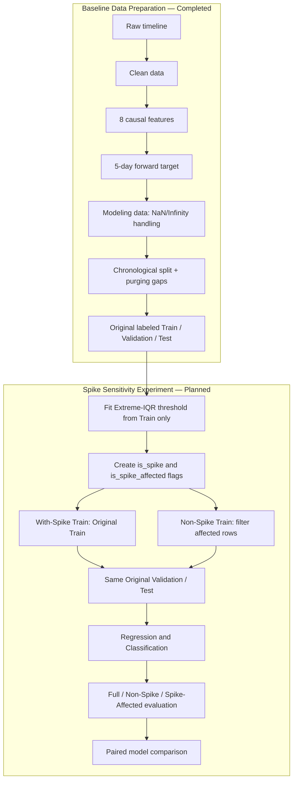

# QQQ Volatility Forecasting — Project Status

> ตรวจสอบล่าสุด: 2026-10-06
>
> ขอบเขต M1: อ่าน baseline inputs และ saved reports โดยไม่แก้ไข; เขียนเฉพาะ generated `outputs/reports/spike_input_contract.json` รวมถึง source/tests/docs ของ M1
>
> ฐานของการสำรวจเดิมก่อน Phase 1: branch `main`, commit `115a054`; tracked working tree สะอาด
>
> ผลทดสอบล่าสุดหลังทำ M1: `245 passed, 1 skipped` จาก `.venv\Scripts\python.exe -m pytest -q -rs` (symlink case ข้ามบน Windows ที่ไม่มีสิทธิ์สร้าง symlink)

## 1. ภาพรวมโปรเจกต์

โปรเจกต์ใช้ daily QQQ OHLCV เพื่อพยากรณ์ realized volatility ล่วงหน้า 5 trading days โดยมีปัญหาเดิมสองแบบ:

- Regression: ทำนาย `target_volatility_5d`
- Classification: ทำนาย `target_high_volatility` จากนิยาม Train-only Q75

Data Preparation เดิมทำเสร็จถึงขั้นสร้าง chronological Train/Validation/Test พร้อม purging gap และ labeled splits แล้ว แต่ model training, model evaluation และ persisted model artifacts ยังไม่เริ่ม

### Requirement ใหม่: With-Spike vs Non-Spike sensitivity experiment

ก่อนเริ่ม model training ต้องเพิ่มการทดลองแบบ paired comparison โดยคง Regression/Classification, features, targets, split boundaries และ main Validation/Test เดิม:

- **With-Spike Case:** ใช้ Original Train ทั้งหมด เป็น baseline experiment
- **Non-Spike Case:** ตัดเฉพาะ modeling rows ใน Train ที่ `is_spike_affected == True` ออก เพื่อวัด sensitivity ต่อ extreme daily-return events

Requirement นี้เพิ่มภายหลัง Data Preparation เดิม ปัจจุบัน M1 Baseline Input Contract และ frozen pure rule primitives พร้อม synthetic tests แล้ว แต่ยังไม่มี experiment datasets, direct spike audit, Phase 2 experiment runner/reports/figures หรือ model artifacts จึง **ยังไม่ถือว่าเสร็จ**

Historical snapshot สำหรับผลปัจจุบันคือ `data/raw/qqq_daily.csv` จำนวน 2,512 แถว ช่วง 2016-08-31 ถึง 2026-08-28 และ SHA-256 `649e1db1b79c0990ea947a4ea162d6836b9bbdda2af24bc5ab6ae66cb83b6b13` ตรงกับ `data/manifests/qqq_daily_snapshot.json`

## 2. Requirement และสถานะปัจจุบัน

| Requirement | สถานะ | หลักฐานปัจจุบัน | หมายเหตุ |
| --- | --- | --- | --- |
| Snapshot verification และแยก Live refresh | ✅ เสร็จแล้ว | `src/download_qqq_data.py`, `data/manifests/qqq_daily_snapshot.json`, `tests/test_download_qqq_data.py` | Snapshot ไม่ถูก Live downloader เขียนทับ |
| Load/validate daily QQQ OHLCV | ✅ เสร็จแล้ว | `src/load_data.py`, `tests/test_load_data.py` | ใช้ `Close`; ไม่ใช้ `Adj Close` |
| Cleaning และ clean artifact | ✅ เสร็จแล้ว | `src/clean_data.py`, `data/interim/qqq_clean.csv`, `outputs/reports/cleaning_report.json` | 2,512 → 2,512 แถว |
| Causal feature engineering | ✅ เสร็จแล้ว | `src/build_features.py`, `tests/test_features.py`, `tests/test_leakage.py` | 8 features จาก timeline เดิม |
| Regression target 5 วัน | ✅ เสร็จแล้ว | `src/build_targets.py`, `tests/test_targets.py` | `t+1` ถึง `t+5`, `ddof=1`, `sqrt(252)` |
| Chronological split พร้อม purging gap | ✅ เสร็จแล้ว | `src/split_data.py`, `tests/test_split_data.py` | 70/15/15 และ gap 5 แถวสองช่วง |
| Classification target จาก Original Train Q75 | ✅ เสร็จแล้ว | `src/build_targets.py`, `outputs/reports/classification_threshold.json` | strict `>`; threshold `0.2530580184684854` |
| Data Preparation notebooks | ✅ เสร็จแล้ว | `notebooks/01_data_cleaning.ipynb`, `notebooks/02_eda_and_features.ipynb` | มี saved cell outputs; working directory ปัจจุบันไม่มี exported PNG ใต้ `outputs/figures/` |
| Spike analysis | 🟡 ทำบางส่วน | `src/build_spike_input_contract.py`, `src/spike_contract.py`, tests, `PHASE2_SPIKE_READINESS.md` และ Notebook 02 | M1 input contract และ rule/boundary primitives พร้อมแล้ว; ยังไม่มี experiment datasets หรือ saved spike figures |
| Train-only spike threshold | 🟡 Contract only | Pure fit/apply API และ synthetic tests | ยังไม่มี Phase 2 detector runner/report; ตัวเลข audit ไม่ถูก hard-code |
| With-Spike experiment dataset | ⬜ ยังไม่พบว่าดำเนินการ | Original split มีอยู่ แต่ยังไม่มี experiment copy/manifest | ต้องสร้าง artifact แยกและยืนยัน checksum |
| Non-Spike experiment dataset | ⬜ ยังไม่พบว่าดำเนินการ | ไม่มี affected mask หรือ filtered artifact | ห้ามแก้ Original Train |
| Full/Non-Spike/Spike-Affected evaluation | ⬜ ยังไม่พบว่าดำเนินการ | ไม่มี diagnostic segment artifacts/metrics | Full Test ต้องเป็นผลหลัก |
| Paired model comparison | ⬜ ยังไม่พบว่าดำเนินการ | `src/models/*.py` ยังมีเพียง module docstring | ต้องควบคุม protocol ให้เหมือนกันทั้งสอง cases |
| Regression model training | ⬜ ยังไม่พบว่าดำเนินการ | `src/models/regression.py`, `notebooks/03_regression.ipynb` | Notebook มี 0 cells |
| Classification model training | ⬜ ยังไม่พบว่าดำเนินการ | `src/models/classification.py`, `notebooks/04_classification.ipynb` | Notebook มี 0 cells |
| Automated tests | ✅ Baseline + contract verified | `tests/`, `pytest.ini` | 245 tests ผ่าน, 1 symlink test ข้ามบน Windows; รวม spike-boundary 14 tests และ M1 input-contract 39 tests |
| Project runbook/data provenance | 🟡 ทำบางส่วน | `README.md`, `PHASE2_SPIKE_READINESS.md`, Manifest, config และ runners | M1 contract และ isolated reproduction verified; Phase 2 experiment runner ยังไม่เริ่ม |

## 3. Data Pipeline

### 3.1 Baseline pipeline — ทำแล้ว

1. `data/raw/qqq_daily.csv` → schema/snapshot verification
2. Cleaning → `data/interim/qqq_clean.csv`
3. Feature engineering บน complete timeline → `data/interim/qqq_features.csv`
4. Target construction บน complete timeline → `data/interim/qqq_regression_target.csv`
5. NaN/Infinity handling บน modeling copy
6. Chronological split พร้อม 5-row purging gaps → Original Train/Validation/Test
7. Fit Classification Q75 จาก Original Train → labeled splits

### 3.2 Spike experiment branch — Contract verified; artifacts planned



ข้อห้ามสำคัญ: ห้ามลบ spike จาก Raw ก่อน `pct_change()` เพราะจะสร้าง return ข้ามวันที่ และห้าม recompute features/targets หลังกรอง ต้องสร้างทุก feature/target จาก complete timeline ก่อน แล้วจึงกรองเฉพาะ modeling copy

## 4. Current State ที่ตรวจจากไฟล์จริง

- Baseline artifacts มี Raw, Clean, Features, Regression target, Original splits และ labeled splits ครบใน working directory
- Reports ปัจจุบันมี `cleaning_report.json`, `feature_report.json`, `data_split_report.json` และ `classification_threshold.json`
- `README.md` อธิบาย Snapshot verification, Live refresh และ baseline pipeline แล้ว ไม่ใช่ไฟล์ว่าง
- `outputs/figures/` ปัจจุบันมีเพียง `.gitkeep`; ภาพที่ Notebook อ้างถึงไม่ได้อยู่ใน working directory นี้ จึงต้อง regenerate/verify ภายหลังโดยไม่อ้างว่ามี saved PNG แล้ว
- `src/models/regression.py` และ `src/models/classification.py` ยังไม่มี implementation; Notebook 03/04 ว่าง
- ยังไม่มี orchestration script สำหรับ baseline end-to-end pipeline และยังไม่มี Regression target JSON report
- Reports บางไฟล์เก็บ absolute path จากเครื่องปัจจุบัน ทำให้ byte checksum ต่างข้ามเครื่องได้ แม้สาระข้อมูลเหมือนกัน

## 5. Features, Targets และ Spike Design Decisions

### 5.1 Features และ Targets เดิม

| ชื่อ | สูตร/ความหมายย่อ | สถานะในการทดลอง Spike |
| --- | --- | --- |
| `return_1d` | `Close.pct_change(1)` | เป็นตัวตรวจ spike หลัก: `abs(return_1d)` |
| `return_5d` | `Close.pct_change(5)` | สูตรเดิม ไม่ recompute หลังกรอง |
| `historical_volatility_5d` | trailing 5-return std × `sqrt(252)` | ใช้วิเคราะห์ผลกระทบ ไม่ใช้ OR เพื่อตรวจ spike |
| `historical_volatility_20d` | trailing 20-return std × `sqrt(252)` | ใช้วิเคราะห์ผลกระทบ ไม่ใช้ OR เพื่อตรวจ spike |
| `intraday_range` | `(High - Low) / Close` | สูตรเดิม |
| `sma_ratio_5_20` | trailing `SMA_5 / SMA_20` | สูตรเดิม |
| `rsi_14` | Wilder RSI 14 | สูตรเดิม |
| `volume_zscore_20` | rolling 20-day Volume z-score | สูตรเดิม |
| `target_volatility_5d` | `std(return_1d[t+1:t+5], ddof=1) * sqrt(252)` | สร้างก่อนกรองและห้าม recompute |
| `target_high_volatility` | `target_volatility_5d > Original Train Q75` | ใช้ Q75 เดิมทั้ง With-Spike และ Non-Spike |

ห้ามคำนวณ Classification Q75 ใหม่จาก Non-Spike Train เพราะจะเปลี่ยนนิยาม High Volatility ระหว่าง cases

### 5.2 Spike detection ที่กำหนดแล้ว

```python
abs_return = train_data["return_1d"].abs()
q1 = abs_return.quantile(0.25)
q3 = abs_return.quantile(0.75)
iqr = q3 - q1
spike_threshold = q3 + 3.0 * iqr
is_spike = abs_return > spike_threshold
```

- Fit `q1`, `q3`, `iqr` และ threshold จาก **Original Train เท่านั้น**
- ใช้ strict `>`; ค่าเท่ากับ threshold ไม่เป็น spike
- ใช้ threshold เดียวกัน flag Validation/Test เพื่อ diagnostic เท่านั้น
- `3 × IQR` เป็น main rule เพราะต้องการตัดเฉพาะ extreme spike ไม่ใช่ volatility ปกติ
- เปรียบเทียบ sensitivity กับ `1.5 × IQR`, Train p99 และ Robust Z-score

### 5.3 Direct และ affected rows

- `is_spike`: แถวที่ `abs(return_1d) > spike_threshold`
- `is_spike_affected`: modeling row ที่ feature หรือ target อาจได้รับอิทธิพลจาก spike
- ตาม design ที่ได้รับ เมื่อ spike อยู่ตำแหน่ง `s` ให้ flag ช่วง `s-5` ถึง `s+19` โดย clip ที่ขอบ split
- มุมมองเทียบเท่า: row `t` ถูก flag หากมี spike ในช่วง `t-19` ถึง `t+5`

ช่วงนี้มาจาก forward target horizon 5 และ finite rolling windows สูงสุด 20 การลบเฉพาะ direct spike จะยังเหลือผลใน rolling features และ forward targets

**Conflict ที่พบจาก source:** `src/build_features.py::_wilder_average()` คำนวณ `rsi_14` แบบ recursive Wilder average ดังนั้น return spike มีอิทธิพลแบบลดทอนต่อ RSI หลัง `s+19` ได้ในทางคณิตศาสตร์ และคำกล่าวว่า “maximum feature lookback = 20” จึงไม่จริงสำหรับทุก feature อย่างเคร่งครัด ค่า affected 213 แถวด้านล่างเป็นผลตาม window ที่กำหนด `s-5:s+19`; ก่อน freeze config ต้องตัดสินใจว่าจะยอมรับ window นี้เป็น operational definition, กำหนด RSI decay tolerance หรือขยาย affected logic โดยไม่เปลี่ยนสูตร feature เดิม

## 6. Dataset, Split และค่าที่ตรวจยืนยัน

### 6.1 Baseline dataset

| Dataset | ช่วงวันที่ | แถว | หมายเหตุ |
| --- | --- | ---: | --- |
| Raw/Clean | 2016-08-31 ถึง 2026-08-28 | 2,512 | Raw checksum ตรง Manifest; 0 duplicate dates, 0 missing OHLCV |
| Modeling-ready ก่อน gaps | 2016-09-29 ถึง 2026-08-21 | 2,487 | กรอง 25 warm-up/end rows |
| Original Train | 2016-09-29 ถึง 2023-08-18 | 1,733 | Class 0/1 = 1,300/433 |
| Original Validation | 2023-08-28 ถึง 2025-02-19 | 371 | Class 0/1 = 337/34 |
| Original Test | 2025-02-27 ถึง 2026-08-21 | 373 | Class 0/1 = 300/73 |

มี gap 5 แถวระหว่าง Train–Validation และ Validation–Test รวม 10 แถว; boundaries เหล่านี้ต้องไม่เปลี่ยนในการทดลอง

### 6.2 Read-only spike audit เพื่อยืนยันค่าที่คาด

ค่าต่อไปนี้คำนวณใหม่จาก `data/processed/train_labeled.csv` เมื่อ 2026-10-05 โดยไม่ได้สร้าง artifact และยังไม่ใช่ spike pipeline ที่ implement แล้ว:

| ค่า | ผลที่ตรวจยืนยัน |
| --- | ---: |
| Train rows | 1,733 |
| `Q1(abs(return_1d))` | 0.0029797377830751 |
| `Q3(abs(return_1d))` | 0.0138707144726510 |
| `IQR` | 0.0108909766895759 |
| Main threshold: `Q3 + 3 × IQR` | 0.0465436445413787 (ประมาณ 4.65%) |
| Direct spike days, strict `>` | 19 (ประมาณ 1.10% ของ Train) |
| Spike-affected Train rows (`s-5:s+19`) | 213 |
| Planned Non-Spike Train rows | 1,520 |
| Non-Spike Train Class 0/1 | 1,240/280 |
| Non-Spike Train High ratio | 18.4211% |

ค่าจาก prompt ตรงกับไฟล์จริงภายใน precision ที่แสดง ไม่มีข้อแตกต่างเชิงสาระ

Sensitivity check แบบ read-only:

| Method | Threshold/กติกาที่ใช้ตรวจ | Direct rows |
| --- | ---: | ---: |
| `Q3 + 1.5 × IQR` | 0.0302071795070148 | 91 |
| `Q3 + 3 × IQR` (main) | 0.0465436445413787 | 19 |
| Train p99, strict `>` | 0.0487619470246741 | 18 |
| Robust Z-score | `0.6745 × (abs_return - median) / MAD > 3.5` | 72 |

Robust Z-score formula/cutoff ด้านบนเป็นวิธี sensitivity ที่เสนอไว้ ต้อง freeze ใน experiment config และ report ก่อนถือเป็น contract

เมื่อนำ main Train threshold ไปตรวจแบบ read-only พบ Validation มี 0 direct spike; Test มี 4 direct spikes และ 54 spike-affected rows (319 non-affected rows) ตัวเลขนี้เป็น diagnostic estimate ยังไม่มี segment artifact

### 6.3 Planned experiment datasets

| Dataset | Train | Validation | Test | จุดประสงค์ |
| --- | --- | --- | --- | --- |
| With-Spike | Original Train 1,733 rows | Original Validation | Original Test | Baseline |
| Non-Spike | Filter `is_spike_affected == True` ออกจาก Train; audit ปัจจุบันคาด 1,520 rows | Original Validation | Original Test | Sensitivity experiment |

ห้าม re-split, shuffle, ย้าย Validation/Test เข้า Train, เปลี่ยน purging gaps หรือ recompute features/targets หลังกรอง

Planned Test diagnostics ซึ่งแยกจาก Main Test:

1. **Full Test:** Original Test ทั้งหมด เป็น final evaluation หลัก
2. **Non-Spike Test Segment:** แถว Test ที่ `is_spike_affected == False`
3. **Spike-Affected Test Segment:** แถว Test ที่ `is_spike_affected == True` สำหรับ stress test

## 7. Experiment Protocol และ Planned Artifacts

### 7.1 Paired comparison

ทุก algorithm ต้องรันเป็นคู่ เช่น `Model A + With-Spike Train` เทียบกับ `Model A + Non-Spike Train` โดยควบคุม feature columns, target definition, Validation/Test periods, scaling strategy, hyperparameter search space, random seed และ metrics ให้เหมือนกัน

Scaler, imputer, feature selector, sampler และ preprocessing อื่นต้อง fit แยกจาก Training Case ของตนเองเท่านั้น ห้ามใช้ Test เลือก model หรือ spike threshold หาก tune prediction threshold ให้ใช้ Validation เท่านั้นและบันทึกวิธี

- Regression: MAE, RMSE, R²; ใช้ MAPE เฉพาะเมื่อพิสูจน์ว่าเหมาะกับ target
- Classification: Accuracy, Precision, Recall, F1, ROC-AUC, PR-AUC และ Confusion Matrix; ห้ามสรุปจาก Accuracy อย่างเดียว
- รายงาน metrics แยก Full Test, Non-Spike Test Segment และ Spike-Affected Test Segment

สำหรับ tabular models ช่องว่างวันที่ใน Non-Spike Train ยอมรับได้เพราะ features/targets สร้างก่อนกรอง หากเพิ่ม sequence model เช่น LSTM ภายหลัง ต้องห้ามสร้าง sequence ข้ามช่องว่าง

### 7.2 Planned artifacts — ยังไม่สร้าง

```text
src/detect_spikes.py
src/build_experiment_datasets.py
tests/test_spike_detection.py
tests/test_experiment_datasets.py

data/processed/experiments/with_spikes/train.csv
data/processed/experiments/non_spike/train.csv

outputs/reports/spike_analysis.json
outputs/reports/experiment_dataset_report.json

outputs/figures/spike_analysis/daily_return_spikes.png
outputs/figures/spike_analysis/volatility_spike_effect.png
outputs/figures/spike_analysis/threshold_comparison.png
outputs/figures/spike_analysis/dataset_comparison.png
```

`spike_analysis.json` และ `experiment_dataset_report.json` ต้องเก็บ detection variable, formula, multiplier, Q1/Q3/IQR, threshold, source split, strict comparison rule, direct count/dates, affected-row count, before/after rows, date ranges, class distribution, source checksums และ generated artifact paths

## 8. Problems และ Risks

| ความเสี่ยง | ผลกระทบ | วิธีป้องกัน |
| --- | --- | --- |
| Threshold leakage | Threshold ดูข้อมูลอนาคตและให้ผล optimistic | Fit จาก Original Train เท่านั้น; test ว่าแก้ Validation/Test แล้ว threshold ไม่เปลี่ยน |
| ลบ Raw rows ก่อนคำนวณ return | `pct_change()` เชื่อมราคาข้ามวันที่และเปลี่ยนความหมายข้อมูล | สร้าง features/targets บน complete timeline ก่อนกรอง modeling copy |
| ลบเฉพาะ direct spike | Rolling features/forward target ยังปนผล spike | ใช้ affected window `s-5` ถึง `s+19` และ test boundaries |
| Class imbalance หลังกรอง | Class 1 ลดจาก 433 เป็น 280 ตาม audit ทำให้ classifier เอนเอียง | รายงาน distribution ก่อนตัดสินใจ; class weights/sampling ต้อง fit เฉพาะ Train |
| เปรียบเทียบคนละ Test set | Metrics ไม่สามารถเทียบกันอย่างยุติธรรม | ใช้ Original Validation/Test เดียวกันทั้ง cases; segments เป็น diagnostics เท่านั้น |
| Re-split หลังกรอง | เปลี่ยนช่วงเวลาและอาจนำข้อมูลอนาคตย้อนเข้า Train | Freeze boundaries/gaps เดิมและ filter เฉพาะ Train |
| ใช้ Q75 คนละค่า | นิยาม class แตกต่างระหว่าง cases | ใช้ Original With-Spike Train Q75 ค่าเดิม |
| เลือก spike threshold หลังเห็น Test | Test leakage และ overfitting ต่อ benchmark | Freeze detector/config ก่อน model training; Test ใช้ final evaluation เท่านั้น |
| Sample size ลดลง | Non-Spike model มีข้อมูลน้อยกว่าและ variance สูงขึ้น | รายงานจำนวน/ช่วงวันที่/checksum และตีความ trade-off กับ event coverage |
| Sequence ข้ามช่องว่าง | LSTM อาจถือวันไม่ต่อเนื่องว่าเป็น sequence ต่อเนื่อง | หากใช้ sequence model ให้สร้าง contiguous-segment rule และ tests เพิ่ม |
| Recursive RSI เกิน 20 แถว | Window `s-5:s+19` ไม่ได้กำจัดอิทธิพลของ spike ต่อ Wilder RSI ทั้งหมด | ระบุเป็น operational approximation และ freeze decay policy/affected rule ก่อนสร้าง artifact |
| Spike เป็นเหตุการณ์ตลาดจริง | การกรองอาจลดความสามารถรับมือ crisis regime | รักษา With-Spike baseline และประเมิน Spike-Affected Test เป็น stress test |
| Saved figures ไม่อยู่ในเครื่องปัจจุบัน | หลักฐานภาพไม่ reproducible จาก working directory นี้ | Regenerate ตาม pipeline ที่กำหนดและตรวจ artifact paths/checksums |

## 9. งานที่ต้องทำต่อ

### Phase 1 — Baseline Data Preparation Hardening

- [x] Snapshot verification, baseline cleaning/features/targets/splits/labels และ unit tests
- [x] เพิ่ม end-to-end data runner และ integration test โดยไม่เขียนทับ Raw/Snapshot
- [x] เพิ่ม Regression target report และปรับ report paths ให้ portable
- [x] **อัปเดต `README.md` เป็นงานสุดท้ายของ Phase 1** — มีคำสั่งรัน pipeline ตั้งแต่ Snapshot verification ถึง labeled splits, อธิบาย input/output artifacts, safety rule ที่ห้ามเขียนทับ Raw/Snapshot และผลทดสอบที่คาดหวัง

### Phase 2 — Spike Analysis และ Experiment Dataset Preparation

| # | Task | ไฟล์ที่ควรสร้าง/แก้ | Input | Output | Dependency | Definition of Done |
| ---: | --- | --- | --- | --- | --- | --- |
| 1 | ยืนยัน data contract และ split boundaries | `config.py`, `tests/test_experiment_datasets.py` | Original splits, current reports | Frozen schema/boundary spec | Baseline artifacts | Checksums, rows, dates, gaps และ columns ถูก assert โดยไม่แก้ source |
| 2 | Implement Extreme-IQR detector | `src/detect_spikes.py`, `tests/test_spike_detection.py` | Train `return_1d` | Pure detector API | Task 1 | รองรับ strict `>`, Train-only fit และ deterministic result |
| 3 | คำนวณ threshold จาก Train | `src/detect_spikes.py` | Original Train | Threshold metadata | Task 2 | ได้ Q1/Q3/IQR/threshold จาก Train เท่านั้นและไม่ hard-code |
| 4 | สร้าง Direct Spike report | `outputs/reports/spike_analysis.json` | Threshold + Original Train | Count, dates, formulas, checksum | Task 3 | Strict JSON ตรงกับ detector และ rerun เหมือนเดิม |
| 5 | ตรวจ spike dates กับ OHLCV/source | report/notebook ที่กำหนดภายหลัง | Spike dates + Clean/Raw OHLCV | Audited event table/notes | Task 4 | ทุก date trace กลับ source ได้; แยก market event ออกจาก data error |
| 6 | สร้าง spike-affected mask | `src/detect_spikes.py`, tests | Direct flags + horizon/lookback config | `is_spike_affected` | Tasks 3–4 | ครอบคลุม `s-5:s+19`, clip ขอบ และผ่าน boundary tests |
| 7 | สร้าง With-Spike/Non-Spike Train | `src/build_experiment_datasets.py`, experiment CSV paths | Original Train + affected mask | แยก Train สอง cases | Task 6 | Original Train/checksum ไม่เปลี่ยน; kept values ตรง baseline |
| 8 | สร้าง Validation/Test diagnostic flags | `src/build_experiment_datasets.py` | Original Val/Test + Train threshold | Full/non-spike/affected flags | Tasks 3, 6 | ใช้ threshold เดียวจาก Train และไม่เขียนทับ main splits |
| 9 | ตรวจ class distribution | `outputs/reports/experiment_dataset_report.json` | Labeled splits + experiment masks | Before/after counts/ratios | Tasks 7–8 | รายงานทุก split/case และประเมิน imbalance ก่อนเลือก strategy |
| 10 | เพิ่ม spike/experiment tests | `tests/test_spike_detection.py`, `tests/test_experiment_datasets.py` | Pure APIs + fixtures | Automated contract suite | Tasks 2–9 | ครอบคลุม checklist 20 ข้อด้านล่างและ full suite ผ่าน |
| 11 | สร้าง figures/reports | `outputs/figures/spike_analysis/`, reports | Verified flags/datasets | 4 figures + 2 reports | Tasks 4, 7–10 | Figures trace ถึง data; reports strict JSON และ counts ตรง CSV |
| 12 | Freeze experiment configuration | `config.py` และเอกสาร | Approved detector/protocol | Versioned config + checksums | Tasks 9–11 | multiplier, windows, paths, seeds, metrics และ target contract ชัดเจน |
| 13 | อนุญาตให้เริ่ม model training | `src/models/`, Notebook 03/04 ใน phase ถัดไป | Frozen experiment datasets/config | Training-ready gate | Tasks 1–12 | Spike phase artifacts/tests/review ครบก่อนเริ่ม Train |

Spike-specific test checklist สำหรับ Task 10:

1. Threshold fit จาก Train เท่านั้น
2. การเปลี่ยน Validation/Test ไม่ทำให้ threshold เปลี่ยน
3. ใช้ threshold เดียวกันทุก split
4. Direct flag ตรง `abs(return_1d) > threshold`
5. Equality boundary ไม่ถูก flag
6. Affected window ครอบคลุม `s-5` ถึง `s+19`
7. Window clip ถูกต้องที่ต้น/ท้าย split
8. Non-Spike Train ไม่มี affected rows
9. Original Train ไม่ถูกแก้
10. Raw/Clean/Feature/Target artifacts ไม่ถูกแก้
11. Features/targets ของ kept rows ตรง baseline
12. Dates เรียงตามเวลา
13. Split boundaries ไม่เปลี่ยน
14. Purging gaps เดิมถูกต้อง
15. ไม่มี NaN/Infinity ใน model columns
16. Classification Q75 เดิมไม่เปลี่ยน
17. Labels ตรง Original Train Q75
18. Report counts ตรง CSV artifacts
19. Pipeline rerun ให้ผลเดิม
20. ไม่มี return ข้ามวันที่จากการลบ Raw rows

### Phase 3 — Regression Models

- [ ] กำหนด baseline/candidate algorithms และใช้ paired protocol กับทั้งสอง Train cases
- [ ] Implement/test `src/models/regression.py`; เลือกด้วย Validation และประเมิน Test หลัง freeze
- [ ] เติม `notebooks/03_regression.ipynb` พร้อม Full/Non-Spike/Spike-Affected metrics

### Phase 4 — Classification Models

- [ ] กำหนด majority baseline, imbalance policy และ prediction-threshold policy
- [ ] Implement/test `src/models/classification.py` ด้วย Original Train Q75 เดียวกันทั้ง cases
- [ ] เติม `notebooks/04_classification.ipynb` และ metrics ที่ไม่พึ่ง Accuracy อย่างเดียว

### Phase 5 — Evaluation, Documentation และ Presentation

- [ ] บันทึก models, predictions, metrics, configs, seeds และ data checksums
- [ ] สร้าง paired comparison report พร้อม trade-off interpretation
- [ ] อัปเดต README/runbook และ final presentation ให้ trace ตัวเลขกลับ artifacts ได้

## 10. ลำดับงานรอบถัดไป

1. Freeze baseline input checksums, schema, rows, dates และ split boundaries ใน experiment contract
2. Implement pure Extreme-IQR detector พร้อม Train-only/equality/leakage tests
3. สร้าง `spike_analysis.json` และตรวจ 19 spike dates กับ Raw/Clean OHLCV
4. Implement/test affected mask `s-5` ถึง `s+19`
5. สร้าง experiment Train artifacts แยก path โดยไม่แก้ Original Train
6. Flag Original Validation/Test ด้วย Train threshold และสร้าง diagnostic segment definitions
7. สร้าง `experiment_dataset_report.json` พร้อม class distributions/checksums
8. สร้างและตรวจ spike-analysis figures จาก verified artifacts
9. Freeze experiment config/protocol แล้วจึงเริ่ม paired model training

## 11. Definition of Done

### Spike phase

- [ ] Threshold fit จาก Original Train เท่านั้นและมี report พิสูจน์
- [ ] With-Spike และ Non-Spike datasets สร้างซ้ำได้จาก documented command
- [ ] Original Raw/Clean/Features/Targets/Splits และ checksums ไม่เปลี่ยน
- [ ] ไม่มี leakage จาก threshold, preprocessing, tuning หรือ selection
- [ ] Split boundaries และ purging gaps เหมือน baseline
- [ ] Feature/target formulas และ Original Train Q75 เหมือนกันทั้ง cases
- [ ] Main Validation/Test เป็น Original splits เดียวกัน
- [ ] Reports, figures และ spike-specific tests ครบและตรงกับ artifacts

### Modeling และโครงการทั้งหมด

- [ ] Paired models ใช้ algorithms, search space, seed, preprocessing policy และ metrics เดียวกัน
- [ ] Regression รายงาน MAE/RMSE/R² และ Classification รายงาน Accuracy/Precision/Recall/F1/ROC-AUC/PR-AUC/Confusion Matrix
- [ ] Metrics แยก Full/Non-Spike/Spike-Affected Test โดย Full Test เป็นผลหลัก
- [ ] Model selection ใช้ Validation เท่านั้น; Test ใช้ final evaluation
- [ ] ผลเปรียบเทียบอธิบาย trade-off ระหว่าง normal-period performance, crisis robustness และ sample-size reduction ได้
- [ ] Notebook 01–04, runbook และ saved artifacts รัน/ตรวจซ้ำได้จาก clean environment

## 12. Design Decisions และ Open Questions

### Decisions ที่กำหนดแล้ว

- Detection variable คือ `abs(return_1d)`; ไม่ OR ด้วย volatility/target
- Main detector คือ Train-only `Q3 + 3 × IQR`, strict `>`
- Affected window คือ `s-5` ถึง `s+19`
- Features/targets สร้างจาก complete timeline ก่อนกรอง
- Filter เฉพาะ Train modeling copy; ไม่แก้ baseline artifacts
- With-Spike ใช้ Original Train; Non-Spike ตัด affected Train rows
- ทั้งสอง cases ใช้ Original Validation/Test และ Original Train Q75 เดียวกัน
- Test segments เป็น diagnostics; Full Test เป็นผลหลัก
- Model/preprocessing protocol ต้อง paired และ fit จาก Train case ของตนเอง

### Open questions ที่ต้องยืนยันก่อน freeze config

1. จะยอมรับ `s-5:s+19` เป็น operational window แม้ Wilder RSI มี recursive decay ต่อเนื่อง หรือจะกำหนด decay tolerance/affected rule เพิ่มเติม
2. Robust Z-score จะยืนยันสูตร modified z-score และ cutoff `3.5` ตาม sensitivity audit นี้หรือไม่
3. ชื่อ/format ของ diagnostic flags จะเก็บเป็น columns ใน derived artifact หรือเป็น report/sidecar file
4. จะใช้ model algorithms และ hyperparameter search spaces ใดตาม requirement ต้นฉบับ
5. หลังเห็น class distribution จริง จะใช้ class weights หรือ Train-only sampler หรือไม่
6. MAPE เหมาะกับ `target_volatility_5d` หรือควรงดเพราะค่าต่ำอาจทำให้ metric บิดเบือน
7. จะ regenerate exported data-preparation PNG ที่หายจาก working directory ปัจจุบันในขั้นใด

สถานะสรุป: Baseline Data Preparation และ snapshot reproducibility พร้อมใช้งานและ tests ผ่าน ส่วน Spike rule/boundary contract ตรวจแล้วแต่ experiment artifacts และ runner ยังเป็น **Planned** ต้องทำ Phase 2 ที่เหลือให้ครบก่อนเริ่ม Regression/Classification model training
